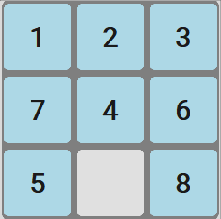
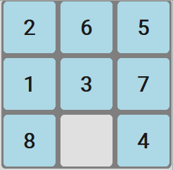
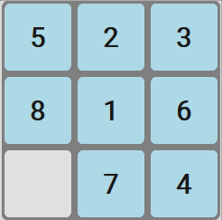
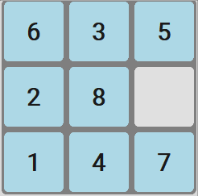
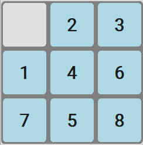
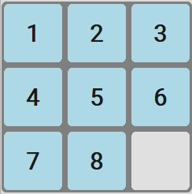
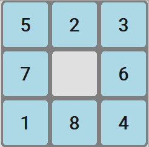
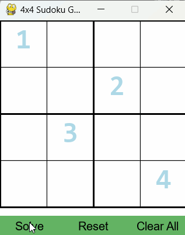
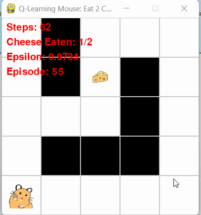

# Báo cáo cá nhân: Tổng quan về các thuật toán tìm kiếm và ứng dụng

## 1. Mục tiêu

Báo cáo này nhằm đạt được các mục tiêu sau:

* Trình bày một cách có hệ thống các khái niệm nền tảng liên quan đến bài toán tìm kiếm trong lĩnh vực Trí tuệ Nhân tạo (AI).
* Phân tích chi tiết, so sánh ưu nhược điểm của các nhóm thuật toán tìm kiếm phổ biến, bao gồm:
    * Tìm kiếm không có thông tin (Uninformed Search)
    * Tìm kiếm có thông tin (Informed Search / Heuristic Search)
    * Tìm kiếm cục bộ (Local Search)
    * Tìm kiếm trong môi trường phức tạp
    * Tìm kiếm trong môi trường có ràng buộc (Constraint Satisfaction Problems)
    * Các khái niệm cơ bản về Học tăng cường (Reinforcement Learning) liên quan đến tìm kiếm.
* Đánh giá khả năng ứng dụng thực tế của từng thuật toán hoặc nhóm thuật toán, minh họa thông qua các ví dụ trực quan như bài toán 8 ô chữ (8-puzzle), tìm đường đi, sudoku hoặc các kịch bản phù hợp khác.
* Trình bày kết quả đạt được

## 2. Nội dung

### 2.1. Giới thiệu chung về bài toán tìm kiếm

Một bài toán tìm kiếm trong AI có thể được định nghĩa thông qua các thành phần cốt lõi sau:

* **Không gian trạng thái (State Space):** Tập hợp tất cả các trạng thái có thể có của bài toán.
* **Trạng thái ban đầu (Initial State):** Trạng thái xuất phát của tác nhân (agent).
* **Hành động (Actions) hoặc Toán tử (Operators):** Tập hợp các hành động mà tác nhân có thể thực hiện để chuyển từ trạng thái này sang trạng thái khác.
* **Hàm chuyển trạng thái (Transition Model/Successor Function):** Mô tả trạng thái kết quả khi thực hiện một hành động tại một trạng thái cụ thể.
* **Trạng thái đích (Goal State) hoặc Kiểm tra đích (Goal Test):** Điều kiện xác định xem một trạng thái có phải là mục tiêu cần đạt được hay không.
* **Chi phí đường đi (Path Cost):** Một hàm gán giá trị số cho một đường đi, thường là tổng chi phí của các hành động tạo nên đường đi đó.

**Giải pháp (Solution)** của một bài toán tìm kiếm là một đường đi (sequence of actions) từ trạng thái ban đầu đến một trạng thái đích.

Các thuật toán tìm kiếm thường được đánh giá dựa trên các tiêu chí sau:

* **Tính đầy đủ (Completeness):** Thuật toán có đảm bảo tìm ra giải pháp nếu có tồn tại hay không?
* **Tính tối ưu (Optimality):** Thuật toán có đảm bảo tìm ra giải pháp tốt nhất (ví dụ: chi phí thấp nhất) nếu có nhiều giải pháp hay không?
* **Độ phức tạp thời gian (Time Complexity):** Mất bao lâu để thuật toán tìm ra giải pháp?
* **Độ phức tạp không gian (Space Complexity):** Cần bao nhiêu bộ nhớ để thuật toán hoạt động?

### 2.2. Các thuật toán Tìm kiếm không có thông tin (Uninformed Search)

Đây là nhóm các thuật toán tìm kiếm mà không sử dụng bất kỳ thông tin nào về bài toán ngoài định nghĩa của bài toán đó. Chúng chỉ biết cách duyệt qua các trạng thái và kiểm tra xem đó có phải là trạng thái đích hay không.

* **Đặc điểm chung:** Các thuật toán này không có thông tin về khoảng cách hay chi phí để đến đích. Việc duyệt không gian trạng thái thường mang tính hệ thống (ví dụ: duyệt từng lớp, hoặc đi sâu vào một nhánh).

#### 2.2.1. Breadth-First Search (BFS) - Tìm kiếm theo chiều rộng

* **Trình bày:** BFS duyệt tất cả các trạng thái ở độ sâu hiện tại trước khi chuyển sang các trạng thái ở độ sâu tiếp theo. Thuật toán sử dụng một hàng đợi (queue) để quản lý các trạng thái sẽ được duyệt.
* **Minh họa:**
    
* **Đánh giá hiệu suất:**
    * Tính đầy đủ: Có (nếu không gian trạng thái hữu hạn).
    * Tính tối ưu: Có (nếu chi phí mỗi bước là như nhau).
    * Độ phức tạp thời gian: $O(b^d)$, với $b$ là yếu tố rẽ nhánh tối đa, $d$ là độ sâu của giải pháp nông nhất.
    * Độ phức tạp không gian: $O(b^d)$.

#### 2.2.2. Depth-First Search (DFS) - Tìm kiếm theo chiều sâu

* **Trình bày:** DFS luôn ưu tiên mở rộng nút sâu nhất trong cây tìm kiếm. Thuật toán sử dụng một ngăn xếp (stack) để quản lý các trạng thái sẽ được duyệt (thường được triển khai đệ quy).
* **Minh họa:**
    
* **Đánh giá hiệu suất:**
    * Tính đầy đủ: Không (nếu có nhánh vô hạn và không giới hạn độ sâu); Có (trong không gian trạng thái hữu hạn).
    * Tính tối ưu: Không.
    * Độ phức tạp thời gian: $O(b^m)$, với $m$ là độ sâu tối đa của không gian trạng thái (có thể tệ hơn BFS).
    * Độ phức tạp không gian: $O(bm)$ (tốt hơn BFS).

#### 2.2.3. Uniform Cost Search (UCS) - Tìm kiếm theo chi phí thống nhất

* **Trình bày:** UCS mở rộng nút chưa được duyệt có chi phí đường đi $g(n)$ thấp nhất từ trạng thái ban đầu. Thuật toán này sử dụng hàng đợi ưu tiên (priority queue). UCS giống BFS nếu tất cả chi phí hành động là như nhau.
* **Minh họa:**
    
* **Đánh giá hiệu suất:**
    * Tính đầy đủ: Có (nếu chi phí bước > 0).
    * Tính tối ưu: Có.
    * Độ phức tạp thời gian: $O(b^{1 + \lfloor C^*/\epsilon \rfloor})$, với $C^*$ là chi phí của giải pháp tối ưu và $\epsilon$ là chi phí hành động tối thiểu.
    * Độ phức tạp không gian: $O(b^{1 + \lfloor C^*/\epsilon \rfloor})$.

#### 2.2.4. Iterative Deepening DFS (IDS) - Tìm kiếm lặp sâu dần

* **Trình bày:** IDS kết hợp ưu điểm của DFS (không gian) và BFS (tính đầy đủ, tối ưu khi chi phí bước như nhau). Thuật toán thực hiện DFS lặp đi lặp lại với giới hạn độ sâu tăng dần (Depth-Limited Search - DLS), bắt đầu từ 0, 1, 2,... cho đến khi tìm thấy giải pháp.
* **Minh họa:**
    
* **Đánh giá hiệu suất:**
    * Tính đầy đủ: Có.
    * Tính tối ưu: Có (nếu chi phí mỗi bước là như nhau).
    * Độ phức tạp thời gian: $O(b^d)$.
    * Độ phức tạp không gian: $O(bd)$.

### 2.3. Các thuật toán Tìm kiếm có thông tin (Informed Search / Heuristic Search)

Nhóm thuật toán này sử dụng kiến thức đặc thù của bài toán, thường dưới dạng một hàm đánh giá heuristic $h(n)$, để ước lượng "sự hứa hẹn" của một nút trong việc dẫn đến trạng thái đích.

* **Đặc điểm chung:** Hàm heuristic $h(n)$ ước lượng chi phí từ nút $n$ đến trạng thái đích. Mục tiêu là hướng tìm kiếm về phía các nút có vẻ gần đích hơn.

#### 2.3.1. Greedy Search (Tìm kiếm tham lam)

* **Trình bày:** Greedy Search mở rộng nút có vẻ gần đích nhất theo ước lượng của hàm heuristic $h(n)$. Nó chọn nút có $h(n)$ nhỏ nhất.
* **Minh họa:**
    
* **Đánh giá hiệu suất:**
    * Tính đầy đủ: Không (có thể bị kẹt trong vòng lặp hoặc đi vào nhánh không tối ưu).
    * Tính tối ưu: Không.
    * Độ phức tạp thời gian: Phụ thuộc vào heuristic, có thể là $O(b^m)$ trong trường hợp xấu nhất.
    * Độ phức tạp không gian: Phụ thuộc vào heuristic, có thể là $O(b^m)$ trong trường hợp xấu nhất.

#### 2.3.2. A* Search

* **Trình bày:** A* là một thuật toán tìm kiếm kết hợp ưu điểm của UCS (tính tối ưu) và Greedy Search (tốc độ nhờ heuristic). A* mở rộng nút có giá trị $f(n)$ nhỏ nhất, trong đó $f(n) = g(n) + h(n)$.
    * $g(n)$: chi phí thực tế từ trạng thái ban đầu đến nút $n$.
    * $h(n)$: chi phí ước lượng từ nút $n$ đến trạng thái đích (heuristic).
* **Tính chất heuristic:** Để A* tìm ra giải pháp tối ưu, hàm heuristic $h(n)$ phải là *chấp nhận được (admissible)*, tức là không bao giờ đánh giá quá cao chi phí thực tế để đến đích (luôn $\le$ chi phí thực). Nếu $h(n)$ còn *nhất quán (consistent)* (hoặc monotonic), A* sẽ hiệu quả hơn.
* **Minh họa:**
    
* **Đánh giá hiệu suất:**
    * Tính đầy đủ: Có.
    * Tính tối ưu: Có (nếu $h(n)$ chấp nhận được).
    * Độ phức tạp thời gian: Phụ thuộc mạnh vào chất lượng heuristic. Có thể rất tốt nếu heuristic tốt.
    * Độ phức tạp không gian: Vẫn có thể lưu trữ nhiều nút trong bộ nhớ, là một hạn chế lớn.

#### 2.3.3. Iterative Deepening A* (IDA*)

* **Trình bày:** IDA* là một biến thể của A* nhằm giảm yêu cầu bộ nhớ. Nó thực hiện một chuỗi các tìm kiếm theo chiều sâu, với mỗi lần tìm kiếm, "ngưỡng $f$-cost" được tăng lên. Trong mỗi lần lặp, IDA* chỉ mở rộng các nút có $f(n)$ không vượt quá ngưỡng hiện tại. Ngưỡng tiếp theo được đặt là giá trị $f$-cost nhỏ nhất đã vượt ngưỡng ở lần lặp trước.
* **Minh họa:**
    
* **Đánh giá hiệu suất:**
    * Tính đầy đủ: Có.
    * Tính tối ưu: Có (nếu $h(n)$ chấp nhận được).
    * Độ phức tạp thời gian: Tương tự A* nếu heuristic tốt, nhưng có thể lặp lại việc duyệt các nút.
    * Độ phức tạp không gian: $O(bd)$ (tương tự IDS).

* **Nhận xét khi áp dụng lên trò chơi 8 ô chữ:**
    * Chất lượng của hàm heuristic là cực kỳ quan trọng. Một heuristic tốt giúp A* và IDA* tìm ra giải pháp nhanh hơn nhiều so với các thuật toán uninformed.
    * Greedy Search có thể nhanh nhưng thường không tối ưu.
    * A* thường cho kết quả tốt nhất về mặt tối ưu và hiệu quả tìm kiếm (nếu bộ nhớ không phải là vấn đề quá lớn). IDA* là giải pháp tốt khi bộ nhớ hạn chế.

### 2.4. Các thuật toán Tìm kiếm cục bộ (Local Search)

Các thuật toán này hoạt động trên một trạng thái hiện tại và di chuyển đến các trạng thái lân cận để tìm kiếm giải pháp, thường là giải pháp "đủ tốt" thay vì tối ưu toàn cục. Chúng không quan tâm đến đường đi đã qua.

* **Đặc điểm chung:** Thường sử dụng ít bộ nhớ, phù hợp cho các bài toán tối ưu hóa lớn mà việc tìm giải pháp tối ưu toàn cục là quá khó khăn.

#### 2.4.1. Hill Climbing (Leo đồi)

* **Khái niệm chung:** Là một vòng lặp liên tục di chuyển theo hướng tăng giá trị (hoặc giảm giá trị, tùy bài toán) của một hàm mục tiêu.
* **Các vấn đề:** Dễ bị kẹt ở *cực đại địa phương (local maxima)*, *mặt phẳng (plateaus)*, và *sống núi (ridges)*.
* **Biến thể:**
    * *Simple Hill Climbing (Leo đồi đơn giản):* Chọn láng giềng đầu tiên tốt hơn trạng thái hiện tại.
    * *Steepest-Ascent Hill Climbing (Leo đồi dốc nhất):* Chọn láng giềng tốt nhất trong tất cả các láng giềng.
    * *Stochastic Hill Climbing (Leo đồi ngẫu nhiên):* Chọn ngẫu nhiên một láng giềng tốt hơn.
* **Minh họa:**
    
* **Đánh giá chung:** Nhanh, ít tốn bộ nhớ nhưng không đảm bảo tìm được giải pháp tối ưu toàn cục.

#### 2.4.2. Simulated Annealing (Ủ mô phỏng)

* **Trình bày:** Lấy cảm hứng từ quá trình ủ kim loại. Thuật toán cho phép di chuyển đến trạng thái xấu hơn với một xác suất nhất định, xác suất này giảm dần theo "nhiệt độ" (một tham số điều khiển). Điều này giúp thoát khỏi cực trị địa phương.
* **Minh họa:**
    
* **Đánh giá hiệu suất:** Có khả năng tìm được giải pháp gần tối ưu toàn cục nếu lịch trình giảm nhiệt độ phù hợp.

#### 2.4.3. Genetic Algorithms (Thuật toán di truyền)

* **Trình bày:** Mô phỏng quá trình tiến hóa tự nhiên. Duy trì một "quần thể" các giải pháp tiềm năng (nhiễm sắc thể). Các giải pháp tốt hơn có nhiều khả năng được chọn để "lai ghép" và "đột biến" tạo ra thế hệ giải pháp mới.
* **Các khái niệm:** Quần thể, Nhiễm sắc thể (Encoding), Hàm thích nghi (Fitness function), Chọn lọc (Selection), Lai ghép (Crossover), Đột biến (Mutation).
* **Minh họa:**
    
* **Đánh giá hiệu suất:** Mạnh mẽ trong không gian tìm kiếm lớn và phức tạp, có khả năng tìm giải pháp tốt nhưng cần nhiều tham số để tinh chỉnh.

#### 2.4.4. Beam Search (Tìm kiếm chùm tia)

* **Trình bày:** Là một biến thể của BFS nhưng chỉ giữ lại $k$ trạng thái tốt nhất (beam width) ở mỗi độ sâu để mở rộng tiếp. Nếu $k=1$, nó giống Greedy Search. Nếu $k=\infty$, nó giống BFS.
* **Minh họa:**
    
* **Đánh giá hiệu suất:** Giảm yêu cầu bộ nhớ so với BFS nhưng có thể mất tính đầy đủ hoặc tối ưu.

#### 2.4.5. So sánh hiệu suất và nhận xét (Nhóm Local Search)

* **Nhận xét ứng dụng:** Phù hợp cho các bài toán tối ưu hóa nơi giải pháp "đủ tốt" là chấp nhận được, ví dụ: lập lịch, thiết kế, TSP.

### 2.5. Tìm kiếm trong môi trường phức tạp

Nhóm này bao gồm các thuật toán được thiết kế cho các môi trường mà tác nhân không có đầy đủ thông tin hoặc môi trường thay đổi.

* **Đặc điểm chung:** Đối phó với sự không chắc chắn, thông tin bị che giấu hoặc các mục tiêu phức tạp dạng AND/OR.

#### 2.5.1. Tree Search AND-OR (Cây tìm kiếm AND-OR)

* **Trình bày:** Sử dụng cho các bài toán mà một giải pháp có thể yêu cầu hoàn thành một tập hợp các tiểu mục tiêu (nút AND) hoặc một trong số các tiểu mục tiêu thay thế (nút OR). Ví dụ: phân tích cú pháp, lập kế hoạch có điều kiện.

#### 2.5.2. Partially Observable (Nhìn thấy một phần)

* **Trình bày:** Trong môi trường quan sát được một phần (POMDPs - Partially Observable Markov Decision Processes), tác nhân không thể biết chắc chắn trạng thái hiện tại của nó. Thay vào đó, nó duy trì một *belief state* (trạng thái niềm tin) - một phân phối xác suất trên các trạng thái có thể. Tìm kiếm được thực hiện trong không gian của các belief state này.

#### 2.5.3. Unknown or Dynamic Environment (Không nhìn thấy hoàn toàn – Tìm kiếm trong môi trường niềm tin)

* **Trình bày:** Tác nhân phải học về môi trường trong khi hành động (exploration) và đồng thời cố gắng đạt được mục tiêu dựa trên những gì đã học (exploitation). Đây là lĩnh vực của học tăng cường. Môi trường có thể không xác định ban đầu hoặc thay đổi theo thời gian.

### 2.6. Tìm kiếm trong môi trường có ràng buộc (Constraint Satisfaction Problems - CSPs)

CSPs là các bài toán mà mục tiêu là tìm một bộ giá trị gán cho các biến sao cho tất cả các ràng buộc được định trước đều được thỏa mãn.

* **Định nghĩa CSP:**
    * **Biến (Variables):** $X = \{X_1, ..., X_n\}$
    * **Miền giá trị (Domains):** $D = \{D_1, ..., D_n\}$, mỗi $D_i$ là tập các giá trị có thể cho $X_i$.
    * **Ràng buộc (Constraints):** $C = \{C_1, ..., C_m\}$, mỗi $C_k$ xác định các tổ hợp giá trị hợp lệ cho một tập con các biến.
* **Ví dụ:** Tô màu đồ thị, Sudoku, Lập lịch.

#### 2.6.1. Backtracking Search (Tìm kiếm quay lui)

* **Trình bày:** Là một dạng DFS gán giá trị cho từng biến một. Nếu một biến được gán giá trị mà vi phạm ràng buộc, thuật toán sẽ *quay lui* (backtrack) để thử giá trị khác hoặc thay đổi giá trị của biến trước đó.
* **Cải tiến:**
    * *Minimum Remaining Values (MRV):* Chọn biến có ít giá trị hợp lệ còn lại nhất.
    * *Least Constraining Value (LCV):* Ưu tiên giá trị mà loại bỏ ít lựa chọn nhất cho các biến lân cận.
* **Minh họa:**
    

#### 2.6.2. Forward Checking

* **Trình bày:** Khi một biến $X_i$ được gán một giá trị, Forward Checking kiểm tra các biến chưa được gán $X_j$ có ràng buộc với $X_i$ và loại bỏ các giá trị trong miền $D_j$ không tương thích với giá trị đã gán cho $X_i$. Nếu miền của biến nào đó trở nên rỗng, việc gán hiện tại là không hợp lệ.

#### 2.6.3. AC-3 (Arc Consistency Algorithm 3)

* **Trình bày:** Là một thuật toán để đạt được *tính nhất quán cung (arc consistency)*. Một cung $(X_i, X_j)$ là nhất quán nếu với mọi giá trị $x \in D_i$, tồn tại một giá trị $y \in D_j$ sao cho $(x,y)$ thỏa mãn ràng buộc giữa $X_i$ và $X_j$. AC-3 loại bỏ các giá trị không nhất quán khỏi các miền cho đến khi không còn thay đổi. Thường được dùng như một bước tiền xử lý hoặc trong quá trình tìm kiếm.

#### 2.6.4. So sánh hiệu suất và nhận xét (Nhóm CSP)

* Backtracking là nền tảng nhưng có thể rất chậm.
* Các kỹ thuật như MRV, LCV, Forward Checking và duy trì tính nhất quán cung (ví dụ AC-3) giúp giảm đáng kể không gian tìm kiếm và tăng tốc độ giải CSP.

### 2.7. Học tăng cường (Reinforcement Learning - RL)

RL là một lĩnh vực của học máy nơi một tác nhân (agent) học cách hành xử trong một môi trường (environment) bằng cách thực hiện các hành động (actions) và nhận các phần thưởng (rewards) hoặc hình phạt.

* **Giới thiệu cơ bản:**
    * **Agent:** Thực thể ra quyết định.
    * **Environment:** Thế giới mà agent tương tác.
    * **State ($s$):** Tình huống hiện tại của agent trong environment.
    * **Action ($a$):** Lựa chọn mà agent có thể thực hiện.
    * **Reward ($r$):** Phản hồi từ môi trường cho hành động của agent.
* **Mục tiêu:** Học một *chính sách (policy $\pi$)* - một ánh xạ từ trạng thái sang hành động - để tối đa hóa tổng phần thưởng kỳ vọng tích lũy theo thời gian.

#### 2.7.1. Q-Learning

* **Trình bày:** Là một thuật toán RL không cần mô hình (model-free) để học giá trị của việc thực hiện một hành động cụ thể trong một trạng thái cụ thể. Nó học một hàm *Q-value* $Q(s,a)$, ước lượng phần thưởng tương lai kỳ vọng khi thực hiện hành động $a$ tại trạng thái $s$ và sau đó tuân theo chính sách tối ưu.
* **Công thức cập nhật Q-value (simplified):**
    $Q(s,a) \leftarrow Q(s,a) + \alpha [r + \gamma \max_{a'} Q(s',a') - Q(s,a)]$
    Trong đó $\alpha$ là tốc độ học (learning rate), $\gamma$ là yếu tố chiết khấu (discount factor).
* **Minh họa:**
    

#### 2.7.2. Temporal Difference (TD) Learning

* **Trình bày:** TD Learning là một lớp các phương pháp học không cần mô hình, học từ kinh nghiệm bằng cách cập nhật ước lượng dựa trên các ước lượng khác (bootstrapping). Q-Learning là một ví dụ của TD control. TD methods cập nhật giá trị ước lượng của một trạng thái dựa trên giá trị ước lượng của trạng thái kế tiếp.
* **Phân loại:**
    * **TD(0):** Cập nhật dựa trên trạng thái và phần thưởng ngay sau đó (như trong Q-Learning cơ bản).
    * **TD($\lambda$):** Sử dụng eligibility traces để cập nhật giá trị của nhiều trạng thái trước đó.
* **Lưu ý:** *Phần này có thể cần nghiên cứu thêm để trình bày chi tiết hơn về sự khác biệt và các biến thể nếu mục tiêu của báo cáo yêu cầu đi sâu.*

#### 2.7.3. Nhận xét và ứng dụng (Nhóm Reinforcement Learning)

* **Tiềm năng:** RL có khả năng giải quyết các bài toán phức tạp mà không cần dữ liệu được gán nhãn trước.
* **Ứng dụng:** Chơi game (AlphaGo), robot tự hành, hệ thống gợi ý, tối ưu hóa tài nguyên.

## 3. Kết luận

Qua quá trình tìm hiểu và tổng hợp, báo cáo này đã trình bày một cách có hệ thống các nhóm thuật toán tìm kiếm chính trong Trí tuệ Nhân tạo, từ các phương pháp kinh điển không có thông tin đến các kỹ thuật nâng cao hơn sử dụng heuristic, tìm kiếm cục bộ, giải quyết ràng buộc và các khái niệm nền tảng của học tăng cường.

**Kết quả chính đạt được:**

* Nắm vững định nghĩa, cơ chế hoạt động, ưu nhược điểm và các tiêu chí đánh giá của từng thuật toán và nhóm thuật toán.
* Hiểu rõ hơn về vai trò của hàm heuristic trong việc cải thiện hiệu quả tìm kiếm.
* Nhận diện được các loại bài toán phù hợp với từng phương pháp tìm kiếm cụ thể.

**Hướng phát triển/nghiên cứu sâu hơn (đề xuất):**

* Triển khai và thực nghiệm so sánh hiệu suất chi tiết hơn giữa các thuật toán trên nhiều bộ dữ liệu hoặc bài toán phức tạp hơn.
* Nghiên cứu sâu hơn về các kỹ thuật heuristic nâng cao và cách xây dựng heuristic hiệu quả.
* Tìm hiểu sâu hơn về các thuật toán trong môi trường quan sát được một phần (POMDPs) và các ứng dụng thực tế của chúng.

**Bài học kinh nghiệm:**

* Việc lựa chọn thuật toán tìm kiếm phụ thuộc rất nhiều vào đặc điểm của bài toán (kích thước không gian trạng thái, sự có sẵn của heuristic, yêu cầu về tính tối ưu, ràng buộc bộ nhớ và thời gian).
* Việc sử dụng thuật toán cần chọn lựa cẩn thận và phù hợp với ứng dụng
* Lý thuyết cần đi đôi với thực hành để có thể đánh giá và áp dụng thuật toán một cách hiệu quả và hiểu rõ bản chất của thuật toán
  
